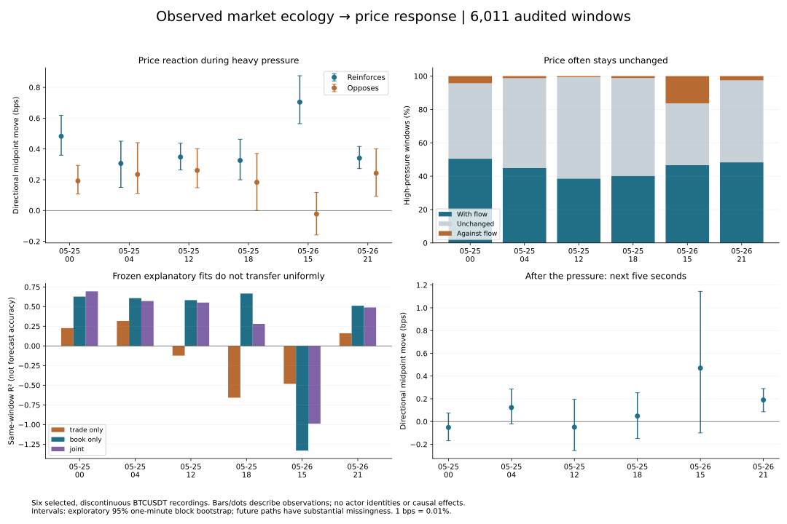

# Observed market ecology and price reactions

Research completed 2 October 2026. This study measures how observed trading pressure and displayed liquidity changes accompany price changes in the supplied BTCUSDT recordings. It does not identify individual participants, establish causality, or certify a profitable policy.

## What the completed analysis found

The measured distinction is between **aggressive trading pressure that coincides with supportive book changes** and **pressure that coincides with opposing book changes**. Trade volume alone is an incomplete description. Displayed liquidity reinforcement has a positive same-window mean contrast in all six recordings, but exploratory confidence intervals exclude zero in only two. The positive contrasts remain in those two recordings after freshness filtering and changing the bootstrap block length. This supports further study of pressure versus replenishment; it does not establish a universal trading rule.

Best-quote OFI distinguishes the same-window reactions more strongly, but its definition includes quote movements. Its apparent explanatory strength is therefore partly mechanical. The frozen book-only regression fails on 26 May at 15:00, despite strong same-window directional association there: a relationship can retain its direction while its magnitude changes enough to break a calibrated model.

## Source and timing audit

Six selected source hours over two days produced **6,011 eligible approximately one-second windows**, of which **4,681** satisfy the additional 250 ms message-age rule. Their summed accepted duration is **101.74 minutes**. These are discontinuous verified segments, not six continuous hours and not independent samples from many days.

Two local midnight order-book copies were incomplete. The full 8,872,131-byte saved original was recovered and its Parquet footer validated. One generated midday CSV did not match its reconstruction count; it was rebuilt before final analysis. Final reconstructed midday, evening and next-day tapes match every original column and row of the four previously corrected tapes. The study now fails if any generated CSV row count differs from its reconstruction audit.

The raw trade audit found **932 records with order_type=NA, price=0 and quantity=0**. These are treated as unknown trade payloads. **250 otherwise eligible windows containing such records were excluded**, rather than assigning zero trading pressure to unknown activity. Existing strategy reports did not apply this new exclusion; their results should not be represented as validation under this stricter observation boundary.

The raw trade files also contain **5 trade-ID gap steps**, all in the 26 May 15:00 recording, spanning **24582 absent IDs**. A window intersecting the receipt interval bracketing such a gap is conservatively rejected. These range exclusions precede the individual missing-payload check; exclusion counts are sequential, not additive overlapping diagnoses.

SHA-256 hashes, source byte sizes, source row counts, sequence reconstruction counts, trade ID integrity and message-age distributions are saved in [source_audit.json](price_mechanics/source_audit.json). Study parameters, fitted coefficients and processed input hashes are in [summary.json](price_mechanics/summary.json).

| Source hour (UTC) | Verified book intervals | Accepted windows | Fresh windows | Missing trade payloads | Windows excluded for missing trades |
|---|---:|---:|---:|---:|---:|
| 2026-05-25_00 | 42,466 | 897 | 807 | 135 | 31 |
| 2026-05-25_04 | 23,614 | 531 | 501 | 109 | 17 |
| 2026-05-25_12 | 55,555 | 1094 | 894 | 122 | 37 |
| 2026-05-25_18 | 57,366 | 1140 | 947 | 66 | 18 |
| 2026-05-26_15 | 50,845 | 875 | 350 | 324 | 64 |
| 2026-05-26_21 | 71,429 | 1474 | 1182 | 176 | 83 |

## Mathematical observation model

Let m be the midpoint of the best bid and ask. The response in basis points is r=10,000 log(m_end/m_start). One basis point is 0.01%. Signed aggressive volume is V=buy BTC−sell BTC, using the recorded buyer-maker flag to infer the aggressor side. Start depth D is displayed bid plus ask quantity within 10 basis points of the start midpoint. Pressure is V/D.

For update n, with bid price b, ask price a and queue sizes qB and qA, the implemented best-quote order-flow imbalance increment is:

$$e_n=1_{b_n\ge b_{n-1}}q^B_n-1_{b_n\le b_{n-1}}q^B_{n-1}-1_{a_n\le a_{n-1}}q^A_n+1_{a_n\ge a_{n-1}}q^A_{n-1}.$$

OFI is the sum of these increments over received update bundles, normalized for regression by the average of the two initial best-quote queue sizes. A bundled update is not a full sequence of individual orders.

Displayed pressure L=(bid additions−bid reductions−ask additions+ask reductions)/D. For buy pressure, bid additions and ask reductions reinforce pressure; ask additions and bid reductions oppose it. Reverse these signs for sell pressure. Reductions do not distinguish executions, cancellations or modifications. The price band is evaluated against each update's pre-midpoint, so moving boundaries and incomplete deeper coverage also affect this measure.

Directional response z=sign(V)r is positive when price moves with the observed aggressive trade direction, negative when it moves against it, and zero when the midpoint is unchanged. All group means and directional probabilities include unchanged outcomes.

High pressure means |V/D| is at or above the 75th percentile among nonzero-pressure windows in 25 May 00:00. Thin depth means D below that first recording's median. These cutoffs, feature normalization and ridge coefficients are frozen before processing subsequent hours. The remaining hours have been inspected in earlier project research, so they are chronological comparisons, not untouched final tests.

Frozen high-pressure cutoff: **0.001057800**; thin-depth cutoff: **364.226 BTC**.

## Price reaction when liquidity reinforces or opposes trade pressure

All rows below condition on high trade pressure. Units are directional midpoint basis points, not executable profit. Brackets are exploratory 95% one-minute block-bootstrap intervals from 1,000 draws. Shared resamples estimate the contrast between conditional means. Intervals are omitted when either group occupies fewer than 10 active blocks.

| Hour | Reinforces: n / mean bps | Opposes: n / mean bps | Reinforces minus opposes, 95% interval | Fresh-only contrast, 95% interval |
|---|---:|---:|---|---|
| 2026-05-25_00 | 148 / 0.482 | 62 / 0.192 | 0.290 [0.117, 0.456] | 0.184 [0.012, 0.341] |
| 2026-05-25_04 | 51 / 0.306 | 29 / 0.235 | 0.071 [-0.218, 0.286] | 0.108 [-0.072, 0.243] |
| 2026-05-25_12 | 127 / 0.348 | 44 / 0.261 | 0.087 [-0.092, 0.230] | 0.005 [-0.175, 0.152] |
| 2026-05-25_18 | 70 / 0.325 | 17 / 0.183 | 0.142 [-0.092, 0.351] | 0.045 [insufficient blocks, insufficient blocks] |
| 2026-05-26_15 | 345 / 0.704 | 231 / -0.023 | 0.727 [0.550, 0.917] | 0.226 [0.104, 0.397] |
| 2026-05-26_21 | 164 / 0.340 | 72 / 0.243 | 0.098 [-0.075, 0.271] | 0.039 [-0.044, 0.122] |

The contrast is a conditional association. Groups are not matched for trade size, starting imbalance, volatility, hidden liquidity or trader information. It cannot isolate a causal liquidity effect. Thin/deep contrasts are also confounded: the pressure criterion itself already divides by depth. Their mixed signs and sparse thin groups do not support claiming a universal depth multiplier in this sample.

## Same-window directional probabilities

"Book agrees" means OFI has the same sign as aggressive flow; "book opposes" means the opposite sign. This includes information observed during the price move and is a retrospective description. Zero observed events do not establish zero population probability; an empirical bootstrap can give a degenerate zero interval in small samples.

| Hour | Book agrees: n / price moves with flow | Book opposes: n / price moves with flow | High pressure: unchanged midpoint |
|---|---:|---:|---:|
| 2026-05-25_00 | 177 / 57.6% | 33 / 12.1% | 45.2% |
| 2026-05-25_04 | 69 / 52.2% | 11 / 0.0% | 53.8% |
| 2026-05-25_12 | 157 / 41.4% | 14 / 7.1% | 60.8% |
| 2026-05-25_18 | 78 / 44.9% | 9 / 0.0% | 58.6% |
| 2026-05-26_15 | 402 / 65.2% | 174 / 4.0% | 37.0% |
| 2026-05-26_21 | 204 / 55.9% | 32 / 0.0% | 49.2% |

Full per-group distributions include 5th/25th/50th/75th/95th percentiles, directional/contrary/unchanged probabilities and block intervals. See the individual hour JSON files in [price_mechanics](price_mechanics).

## Frozen regression and probability diagnostics

The ridge models use alpha=1 and train-only centering/scaling. They explain the already-observed same-window response using (a) trade pressure, (b) OFI pressure, or (c) both plus displayed pressure, initial imbalance, log(1+D), and trade pressure interacted with the thin-depth indicator. OFI contains quote changes; these R² values are not predictive accuracy. Negative R² means the frozen fit is worse than a constant equal to that evaluation hour's realized mean. No-trade/zero-response RMSE is separately saved.

| Hour | Trade-only R² | Book-only R² | Joint R² | Fresh book-only R² |
|---|---:|---:|---:|---:|
| 2026-05-25_00 | 0.226 | 0.627 | 0.694 | 0.640 |
| 2026-05-25_04 | 0.317 | 0.607 | 0.570 | 0.531 |
| 2026-05-25_12 | -0.123 | 0.582 | 0.551 | 0.640 |
| 2026-05-25_18 | -0.658 | 0.666 | 0.280 | 0.562 |
| 2026-05-26_15 | -0.482 | -1.331 | -0.989 | 0.429 |
| 2026-05-26_21 | 0.161 | 0.511 | 0.489 | 0.258 |

Three-state sign mutual information measures dependence between negative/zero/positive flow or book pressure and negative/zero/positive return. Each hour also has 200 whole-minute-block shuffles. These are dependence diagnostics, not causal tests or calibrated p-values: exchangeability of different minutes is not established. Same-window OFI dependence is partly built into quote formation. No multiple-comparison correction was applied to the exploratory group tables; none is a pre-registered discovery claim.

## Does the initial pressure keep moving price?

The following responses start **after** the observed one-second window ends. They require a same-episode endpoint within 250 ms of the five-second target and a book path without receipt gaps above 250 ms. They are conditional on observable paths, so missing exits may change the estimate. Future trade missingness is not used to filter a price-only response. A positive estimate here is not net trading profit.

| Hour | Available high-pressure outcomes | Missing outcomes | Next-five-second aligned mean bps, 95% interval |
|---|---:|---:|---|
| 2026-05-25_00 | 94 | 116 | -0.052 [-0.169, 0.076] |
| 2026-05-25_04 | 45 | 35 | 0.123 [-0.021, 0.287] |
| 2026-05-25_12 | 41 | 130 | -0.049 [-0.255, 0.195] |
| 2026-05-25_18 | 24 | 63 | 0.048 [-0.149, 0.253] |
| 2026-05-26_15 | 99 | 477 | 0.470 [-0.100, 1.145] |
| 2026-05-26_21 | 84 | 152 | 0.190 [0.085, 0.290] |

Only the final recording's overall high-pressure five-second interval excludes zero on the positive side; this exploratory result has substantial missingness and no independent final validation. The other five intervals cross zero. It is evidence to investigate persistence and absorption, not grounds to deploy a profitable strategy.

## How this changes the ecology machinery

The observational baseline should expose: aggressive buy/sell pressure, displayed liquidity reinforcement/opposition, best-quote imbalance, initial depth, observed price response, post-window response and data confidence. A simulator should reproduce their **joint distributions and state transitions**, rather than merely produce a visually moving price.

Operational regime labels can be defined without inventing actor identities: pressure with reinforcement; pressure with opposing liquidity; pressure with unchanged midpoint; and opposing price reaction. "Absorption" and "withdrawal" are hypotheses attached to these observations, not proven institutional intent. Market makers and other participants can add or remove liquidity; anonymous L2 cannot attribute those actions to named categories or recover psychology.

The measured evidence supports investigating state-dependent event intensities and replenishment. It does not justify importing a universal impact coefficient, fitting many models until one wins, or transferring Binance historical calibration directly to the live Coinbase feed. Options/GEX additionally require a chain, volatility surface and stated signed inventory assumptions; those are absent from these six BTCUSDT recordings. Macro bubbles and auctions remain separate research branches.

## Primary research and applicability

* [Cont, Kukanov & Stoikov — The Price Impact of Order Book Events](https://arxiv.org/pdf/1011.6402): supplies the best-quote OFI construction and a hypothesis about depth-dependent impact. Its US-equity results are not calibration for BTCUSDT.
* [Tóth et al. — How does the market react to your order flow?](https://arxiv.org/pdf/1104.0587): motivates studying the interaction of trading pressure and liquidity provision. Its broker-identified data support participant decomposition that our anonymous recordings cannot reproduce.
* [Huang, Lehalle & Rosenbaum — The queue-reactive model](https://arxiv.org/pdf/1312.0563): motivates event intensities conditional on queue state. A faithful queue-reactive simulator still needs calibrated intensities, price-transition rules and validation against empirical distributions; this report does not claim to have implemented that entire model.
* [Gould & Bonart — Queue Imbalance as a One-Tick-Ahead Price Predictor](https://arxiv.org/abs/1512.03492): distinguishes a queue-state conditional probability from deterministic prediction. Different tick structures and markets require separate evaluation; their stock results are not imported as Bitcoin probabilities.

The earlier uploaded-paper integration remains documented in [OCTOBER_RESEARCH_INTEGRATION.md](OCTOBER_RESEARCH_INTEGRATION.md). This study adds microstructure measurements; it does not claim reproduction of every uploaded strategy or a complete model of every participant.

## Reproduction and validation

With numpy, pyarrow, zstandard and matplotlib installed, reconstruct the six supplied books using `python -m src.simulation.book_changes <book files> --out data/processed/mechanics_study_states`. Use the full recovered midnight book, not its incomplete local copies. Run:

```bash
python -m src.simulation.mechanics_input_audit --raw-dir <originals> --recovered-dir <recovered-originals> --states-dir data/processed/mechanics_study_states --out data/processed/ecology_price_mechanics/source_audit.json
python -m src.simulation.ecology_price_mechanics --states-dir data/processed/mechanics_study_states --raw-dir <originals> --out data/processed/ecology_price_mechanics
python tools/report_ecology_mechanics.py --results data/processed/ecology_price_mechanics --out docs/price_mechanics
python -m unittest discover -s tests -p 'test_simulation*.py'
```

Tests cover quote-price/queue OFI changes, exact receipt boundaries, excluded gaps/crossed books, missing trade payload and trade-ID-gap exclusion, conditional group definitions, block contrasts and information sanity checks. Whole-source reconstruction parity was checked for all four previously corrected tapes. Raw files are not redistributed; original source hashes let the owner verify reproduction. Window CSVs are generated locally by the analysis command.



