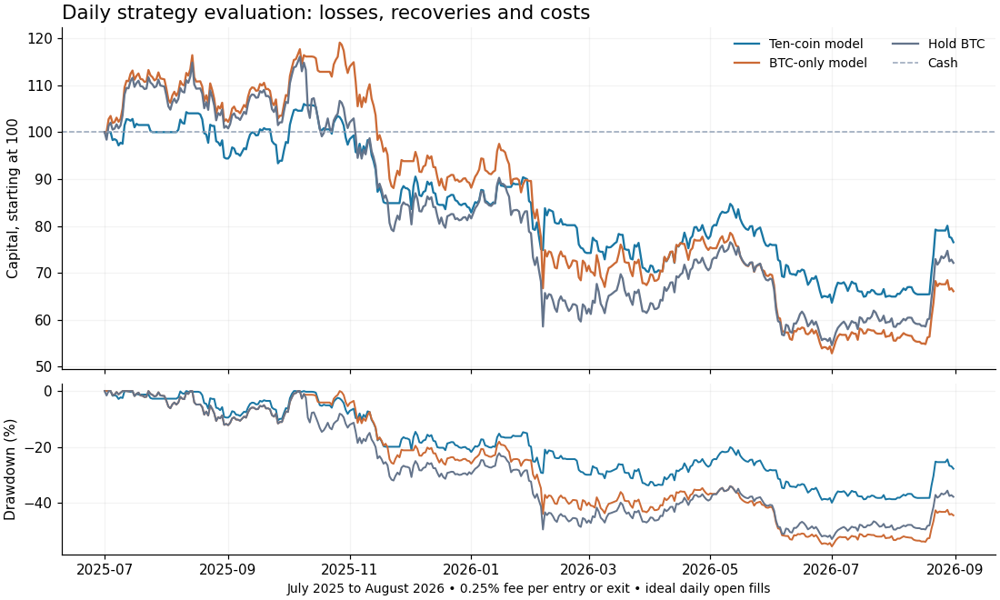

# Daily crossasset LASSO: completed research result

The ten-coin model reduced losses relative to holding BTC in this period, but did not establish profitability. It is not promoted to the live signal engine. No orders are enabled.

## What was built and tested

Downloaded and checksum-verified 440 Binance spot monthly archives: 1,339 daily bars for each of ten coins, January 2023 through August 2026. Dates align exactly; no missing bars or interpolation. All CSV hashes and archive URLs/checksums are saved. The microsecond timestamp change from January 2025 was normalized explicitly. September monthly data was unavailable on the research date; it is not included.

The algorithm compares BTC-only (28 variables) with ten coins (280 variables). It uses seven daily lags of return, quote volume, range variance and illiquidity. These are crossmarket state measurements, not observed participant identities. Each rolling fit uses the latest 714 resolved daily labels; chronological validation on the initial training period selected alpha5 for both models. Both choices were frozen before strategy evaluation. Trades are long/flat at the daily open after a full daily-bar processing delay.

This adapts the supplied Bitcoin/altcoin LASSO paper. Different venue, currencies, years, target timing and chronological validation prevent a claim of faithful replication.

## Main evaluation: July 1, 2025–August 30, 2026

426 daily holding intervals; final liquidation is at the August31 open. Every entry/exit pays 0.25% under the paper benchmark. All returns below use the same idealized open-price convention.

| Approach | Net return | Worst drawdown | Executed trade sides |
|---|---:|---:|---:|
| Ten-coin model | -23.47% | 39.96% | 134 |
| BTC-only model | -33.90% | 55.60% | 52 |
| Hold BTC | -27.86% | 52.97% | 2 |
| Cash | 0.00% | 0.00% | 0 |



## Costs and uncertainty

The ten-coin result is extremely sensitive to cost assumptions:

| Cost per executed side | Ten-coin net return |
|---|---:|
| 0.05% | +0.0926% |
| 0.10% | -6.3986% |
| 0.25% | -23.4692% |

With zero modeled costs, the same signal path returned 7.03%. Its calculated break-even cost is about 5.07 basis points per executed side (about 0.0507%). This is not a measured exchange fill cost. The 0.05% result has an exploratory 95% block-bootstrap interval for mean daily log return of [-16.27, 16.12] basis points: it includes both losses and gains. The bootstrap is conditional on the computed forecast path, does not refit ML and does not correct for multiple comparisons. No dependable edge is established.

## Forecast diagnosis

Crossasset forecast MSE was 69,668 versus 50,251 for BTC-only and 49,376 for forecasting zero. Paired crossasset-minus-BTC squared-error difference averaged 19,417; the approximate 7-day-block bootstrap 95% interval was 946 to 55,244. Larger is worse. A profitable-looking development segment (+4.38% at0.25% per side) did not survive the later evaluation.

The largest ten-coin forecast occurred October 15, 2025: +1,991bps log return versus an observed -202bps. Its formula was dominated by lagged DOGE/ETC range-variance measurements about 63/125 training standard deviations from their means. This is linear extrapolation of unusual market states, not evidence that DOGE or ETC causally moved BTC.199 of426 evaluation days exceeded at least one individual training feature range. These flags were recorded without retrospectively removing trades.

## Interpretation and next development

More coins did not reliably improve price forecasting here. Lower losses than buy-and-hold are not the same as beating cash. The one-day delayed, long/flat recipe still incurred losses after the primary assumed costs.

The next model-development experiment should bound tail-sensitive volatility features, model risk separately from direction, and add a predeclared abstention rule for unsupported states. It must be labeled exploratory on these now-inspected periods, then tested on a subsequently reserved forward paper period. Changing this experiment after seeing its results would invalidate its evaluation label. Longer continuous order-book data remains necessary for the distinct intraday ecology candidate. No additional books are required for these next data/code steps.

## Validation and reproduction

Six software checks cover timestamp units, planted linear signal, label-availability boundary, fee/state arithmetic, terminal liquidation and remaining in cash. An additional run audit checked all 607 forecasts from each model for resolved training labels, initial parameter-selection availability and nonoverlapping daily targets. These are engineering/data checks, not strategies that passed profitability. Two initial crossasset CV fits required a larger solver iteration budget; they converged without changing the objective, tolerance, candidate penalties or trade rules. Attempts are recorded in RESULTS.json.

Run with Python 3.12, numpy 2.3.5 and scikit-learn 1.8.0; matplotlib is optional for the chart. From repository root:

```bash
python -m src.simulation.crossasset_daily_data .
OPENBLAS_NUM_THREADS=1 python -m src.simulation.crossasset_daily_research .
OPENBLAS_NUM_THREADS=1 python -m src.simulation.crossasset_daily_diagnostics .
python -m src.simulation.crossasset_daily_chart .
python -m unittest discover -s tests -p test_simulation_crossasset_daily.py
```

The downloader checks any existing frozen archive manifest before replacing the audit; a provider revision cannot silently overwrite the experiment. Raw daily bars are reproducible from the verified public archives, rather than committed as duplicate market data. Each forecast is saved in the two prediction CSVs.

Limits: some 2026 price periods were inspected in earlier project research, so this is not wholly untouched project-level evidence. Rolling fits learn earlier resolved evaluation outcomes according to the prewritten protocol. Ideal daily opens omit observed spread, latency, size, market impact and stablecoin risk. The fixed ten-coin universe cannot represent all crypto markets. No structural causal, live execution or independent future-profitability claim is made.

Sources: supplied `Bitcoin_and_Main_Altcoins_Causality_and_Trading_St.pdf` (hash in ../strategy_papers/SOURCES.json); [Binance public-data documentation](https://github.com/binance/binance-public-data); [scikit-learn LASSO](https://scikit-learn.org/stable/modules/generated/sklearn.linear_model.Lasso.html) and [chronological validation](https://scikit-learn.org/stable/modules/generated/sklearn.model_selection.TimeSeriesSplit.html).
