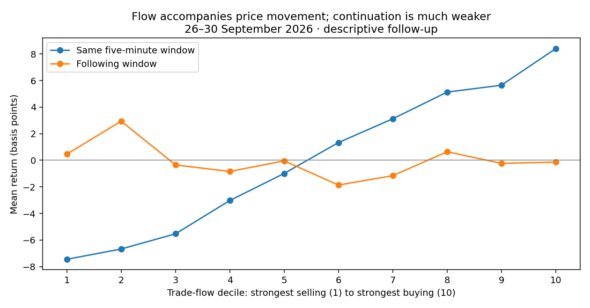

# Thirty-day Bitcoin trade-flow research

Completed 3 October 2026 on Binance USD-M BTCUSDT aggregate trades, 1–30 September 2026 UTC. **36,036,629 rows processed; published SHA-256 verified; zero aggregate-ID gaps; every five-minute bucket present.** This is historical trade-flow research, not a live-trading qualification or full order-book ecology validation.

## What happened

Aggressor buying and selling are strongly associated with price movement during the same interval. In the final five days, the strongest selling-flow decile averaged **−7.45 bps** in the same five-minute window; the strongest buying-flow decile averaged **+8.41 bps**. Their next-window average returns were only **+0.47 bps** and **−0.14 bps**, respectively. These descriptive groups use training-derived boundaries. They do not identify trader types or prove causality.

The fixed five-feature ridge model did **not** improve directional return forecasting. Its final-period mean squared error was **104.59 bps²**, versus **104.47** for predicting zero and **104.48** for predicting the training mean. The daily-block bootstrap interval for model-minus-zero MSE was **[−0.036, +0.257] bps²**; with only five days this is weak evidence, and it does not establish improvement.

All validation candidates took zero trades: predicted returns did not exceed the assumed **6 bps roundtrip cost**. No-trade therefore remained active for the final evaluation, also producing zero trades. This is neither a profitable strategy nor a losing executed strategy: the model did not justify entry under these assumptions. Cost sensitivity holds the original policy decisions fixed.

A follow-up model predicted **movement magnitude** rather than direction. Its log(1 + absolute return in bps) MSE was **0.608**, versus **0.726** for a constant training forecast, an exploratory **16.3% improvement**. This follow-up was designed after seeing the primary result; it needs a new independent period. It may inform a future activity/risk indicator, but does not supply a BUY/SELL signal.



## How it was tested

- 1–20 September: 5,759 training examples; scaling and ridge fit use training only.
- 21–25 September: 1,439 selection examples; excess-cost buffers 0, 2 and 5 bps; no-trade permitted.
- 26–30 September: 1,439 final evaluation examples; no model refit or test-driven policy selection.
- Five-minute feature windows do not overlap. Targets occupy the next block; boundary-crossing training/selection labels are purged. Consecutive samples can remain dependent.
- Features: signed aggressor volume imbalance, same-block return, log volume, log aggregate-trade count and high/low range. Ridge penalty fixed at 0.1.

## Practical limits and next integration

The archive has exchange timestamps but no receipt timestamps. Entry/exit use next-block first/last trade prices as idealized proxies; executable bid/ask, queue fills, market impact and funding are absent. Fees/slippage are assumed, not verified against an account. Aggregate trades cannot reconstruct displayed liquidity, cancellations, maker inventories, GEX or participant identities. The final five days were reserved within this experiment, but now have been examined; future tuning requires a new period. Thirty days is useful coverage, not proof of robustness.

Use these results to separate **current flow-pressure monitoring** from **directional forecasting**. Keep the live trading signal WAIT. Independently replicate the magnitude model before using it for risk controls. Full maker/liquidity testing still requires contiguous L2 plus trades; this archive does not replace that data.

## Reproduce

From the repository root with Python, NumPy and pandas installed:

```bash
python -m src.simulation.download_historical_month data/raw/history30
python -m src.simulation.historical_month_research data/raw/history30/BTCUSDT-aggTrades-2026-09.zip docs/history30/results
python -m src.simulation.historical_flow_diagnostics docs/history30/results
python -m unittest tests.test_simulation_historical_month
```

Official source: https://github.com/binance/binance-public-data

Archive SHA-256: `252e92894886c2f752744656e4f1d7a278a75e1456aa32442451b07ee9703b80`.

See [protocol](PROTOCOL.md), [primary machine-readable results](results/results.json), and [exploratory diagnostics](results/diagnostics.json). The derived CSV is recreated by the runner; the large raw archive is not committed.

Further study: [conditional ecology response models](CONDITIONAL_ECOLOGY.md), including flow/activity combinations, lagged-flow features and 5/15/30-minute price responses.
